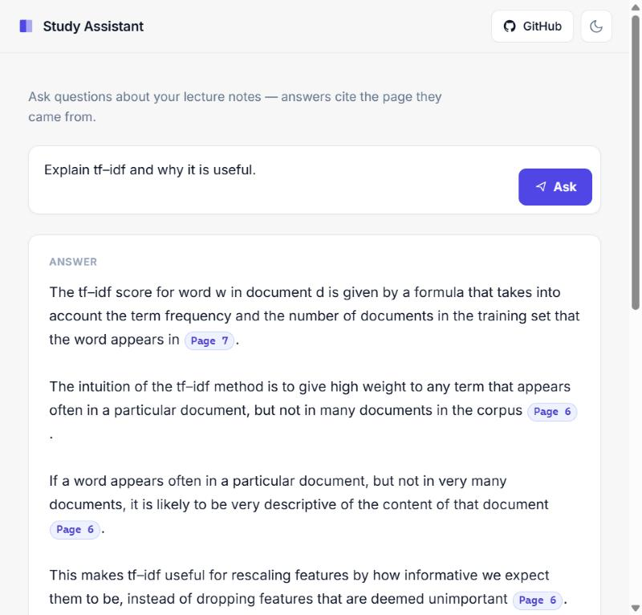
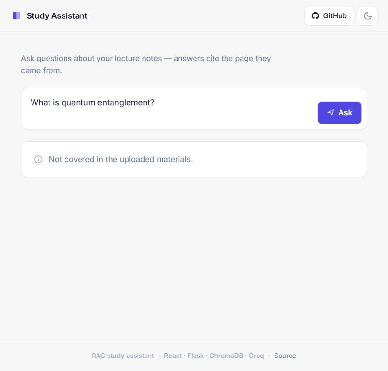
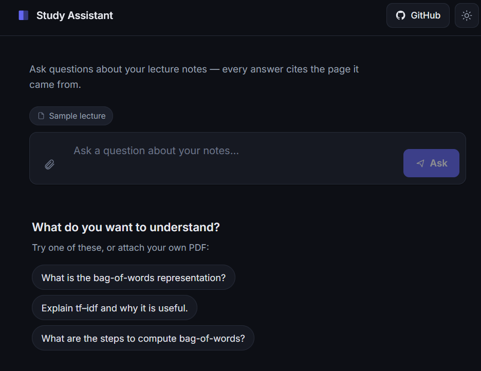

# RAG Study Assistant

> A retrieval-augmented (RAG) study assistant that answers questions about your lecture notes — and **cites the exact page** every answer came from. If something isn't in your slides, it says so instead of making it up.




---

## What it is

I kept re-reading the same lecture slides looking for one definition. So I built a tool I can just *ask*.

You point it at a PDF of your notes once. After that, you ask questions in plain English and it pulls the few most relevant chunks out of your slides, hands them to an LLM, and writes a short answer with `[Page X]` citations so you can jump back to the source. The model only ever sees the retrieved chunks, never the whole PDF, so it can't wander off into things you never uploaded.

The interesting part isn't the chatbot. It's that the answers are **grounded** and **checkable**, and that I measured how good the retrieval actually is instead of just trusting that it "felt right."

## Demo

| Answer with citations | Refuses when it doesn't know |
|---|---|
|  |  |

The landing page before you ask anything:



## Features

- **Cited answers** — every claim is tagged with the page it came from, rendered as little chips in the UI.
- **Honest refusals** — ask it something outside your notes and it replies *"Not covered in the uploaded materials"* instead of hallucinating.
- **Local, free embeddings** — documents are embedded on your own machine with `sentence-transformers`, so indexing costs nothing and needs no API.
- **Fast generation** — answers come from Llama 3.3 70B on Groq.
- **A real evaluation** — a retrieval eval script reports hit-rate so improvements are measurable, not vibes.
- **Clean React UI** — light/dark mode, loading skeletons, graceful error states, keyboard-to-send.

## How it works

RAG is really two separate pipelines.

**1. Ingestion** — runs once, when you add notes. Turns a PDF into searchable vectors.

```
PDF --> PyMuPDF loader --> split into ~500-char chunks --> embed locally (MiniLM) --> ChromaDB
```

**2. Query** — runs on every question. Finds the relevant chunks and asks the LLM to answer *using only those*.

```
question --> embed (same MiniLM) --> top-4 nearest chunks (ChromaDB)
         --> prompt = chunks + question --> Llama 3.3 70B (Groq) --> cited answer
```

The key idea: the LLM never reads your PDF. It only ever sees the 3-5 closest chunks at query time. Retrieval finds the nearest candidates; the prompt makes the model answer from them and refuse if they don't contain the answer.

## Tech stack

| Layer | Choice | Why |
|---|---|---|
| PDF parsing | PyMuPDF | Handles slide layouts well |
| Chunking | LangChain `RecursiveCharacterTextSplitter` | Splits on paragraph/sentence boundaries |
| Embeddings | `all-MiniLM-L6-v2` (local) | Free, no API, runs offline |
| Vector store | ChromaDB | Simple local persistence |
| LLM | Llama 3.3 70B via Groq | Fast and free-tier friendly |
| Orchestration | LangChain | Glues retrieval + LLM together |
| Backend | Flask + flask-cors | Tiny JSON API (`/ask`) |
| Frontend | React 19 + Vite | Single-page UI |

> **Running cost: ~$0.** Embeddings run locally, and Groq's free tier comfortably covers generation for studying.

## Evaluation

A working demo isn't proof the retrieval is good — so `backend/eval.py` measures it. It runs a set of questions where I know the correct page and checks whether retrieval surfaced it. No LLM calls, so it's free to run as often as you like.

Two metrics, on a 12-question set against the sample slides:

| Metric | Meaning | Score |
|---|---|---|
| **Hit@1** | correct page is the *top* result | **75%** |
| **Hit@4** | correct page is *anywhere* in the top 4 | **100%** |

In other words, the right material is always retrieved into context (so the model always has what it needs), and it's the single best match three times out of four. This is also a tuning tool — change the chunk size or `k`, re-run, and watch the numbers move.

```bash
cd backend
python eval.py
```

## Getting started

### Prerequisites

- Python 3.11+
- Node.js 18+
- A free [Groq API key](https://console.groq.com)

### 1. Backend

```bash
# from the project root
python -m venv venv
# Windows:
venv\Scripts\activate
# macOS / Linux:
source venv/bin/activate

pip install -r requirements.txt
```

Create a `.env` file in the project root:

```
GROQ_API_KEY=your_groq_key_here
```

Index your notes (uses `data/sample_slide.pdf` by default — drop your own PDF in `data/` and update `PDF_PATH` in `ingest.py` to use it):

```bash
cd backend
python ingest.py
```

Start the API:

```bash
python app.py          # http://127.0.0.1:5000
```

### 2. Frontend

In a second terminal:

```bash
cd frontend
npm install
npm run dev            # http://localhost:5173
```

Open **http://localhost:5173** and ask away.

## Project structure

```
rag-study-assistant/
├── backend/
│   ├── ingest.py        # ingestion pipeline: PDF -> chunks -> embeddings -> ChromaDB
│   ├── retriever.py     # query pipeline: question -> chunks -> Groq -> cited answer
│   ├── app.py           # Flask API (POST /ask)
│   └── eval.py          # retrieval evaluation (hit@1 / hit@4)
├── frontend/            # React + Vite single-page app
│   └── src/
│       ├── App.jsx
│       └── App.css
├── data/                # your PDFs
├── requirements.txt
└── README.md
```

## Notes & limitations

- Single-PDF demo by default; multi-document collections would need metadata and a collection picker.
- Each question is independent — no conversation memory yet (no "explain that again" follow-ups).
- The vector store (`chroma_db/`) is a build artifact and is gitignored — run `ingest.py` to regenerate it.

## Acknowledgements

The RAG fundamentals here: document loading, splitting, embeddings, vector stores, and retrieval, come from the [**LangChain: Chat with Your Data**](https://learn.deeplearning.ai/courses/langchain-chat-with-your-data/) short course by DeepLearning.AI. This project is my take on those ideas, rebuilt on a local-embeddings + Groq stack and wrapped in a real UI and evaluation.

